# Rigid Body Simulation Framework using MuJoCo  

## 📑 Table of Contents  
- [Abstract](#abstract)  
- [Simulations](#simulations)  
- [Implementation Details](#implementation-details)  
- [Installation](#installation)  
  - [Using Setup.py (Recommended)](#using-setup-py-recommended)  
  - [Manual Setup (Alternative)](#manual-setup-alternative)  
- [How to Run Simulations](#how-to-run-simulations)  
- [License](#license)  

---

## 📝 Abstract  
This project presents a **customizable rigid body simulation framework** leveraging **MuJoCo** for visualization and XML-based environment descriptions, combined with **impulse-based collision resolution** and **friction modeling** implemented in Python. It supports single and multi-sphere collisions, inclined plane simulations, and comparative analysis with MuJoCo’s built-in solver.  

The framework implements and extends upon the formulations from the paper:  

> **"Nonconvex Rigid Bodies with Stacking"**  
> *PEran Guendelman, Robert Bridson & Ronald Fedkiw (2003)*  

🔗 [Download Paper PDF](./data/Nonconvex_Rigid_Bodies_with_Stacking.pdf)  
📄 DOI: [10.1145/882262.88235](https://doi.org/10.1145/882262.882358)  
📄 [Our Report](./data/report.pdf)  

---

## 🎮 Simulations  

### 1️⃣ Single Sphere Bounce  

These simulations demonstrate a single rigid sphere interacting with a flat ground and inclined surfaces, using impulse-based collision resolution and friction modeling inspired by Guendelman et al.'s formulation.  

---

#### ▶️ (a) Single Sphere Bounce without Initial Velocity  
- **Description:**  
A sphere is dropped from rest, bouncing under gravity. The restitution and friction coefficients determine energy dissipation and rotation after impacts.  

▶️ [Watch Recording](data/recordings/single_sphere/single_sphere_bounce_without_initial_velocity.mp4)  

**Plots:**  
- Height vs Time:  
  

- 3D Trajectory:  
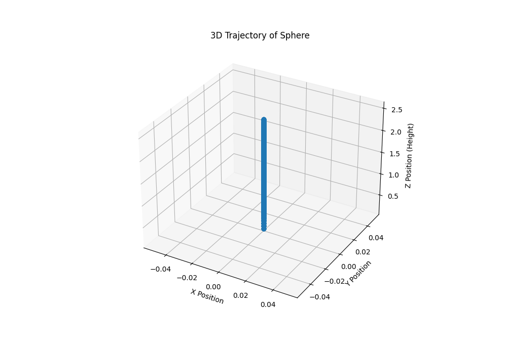  

---

#### ▶️ (b) Single Sphere Bounce with Only Initial Linear Velocity  
- **Description:**  
The sphere is given an initial horizontal velocity. Friction induces rotational motion over subsequent bounces.  

▶️ [Watch Recording](data/recordings/single_sphere/single_sphere_bounce_with_only_linear_velocity.mp4)  

**Plots:**  
- Height vs Time:  
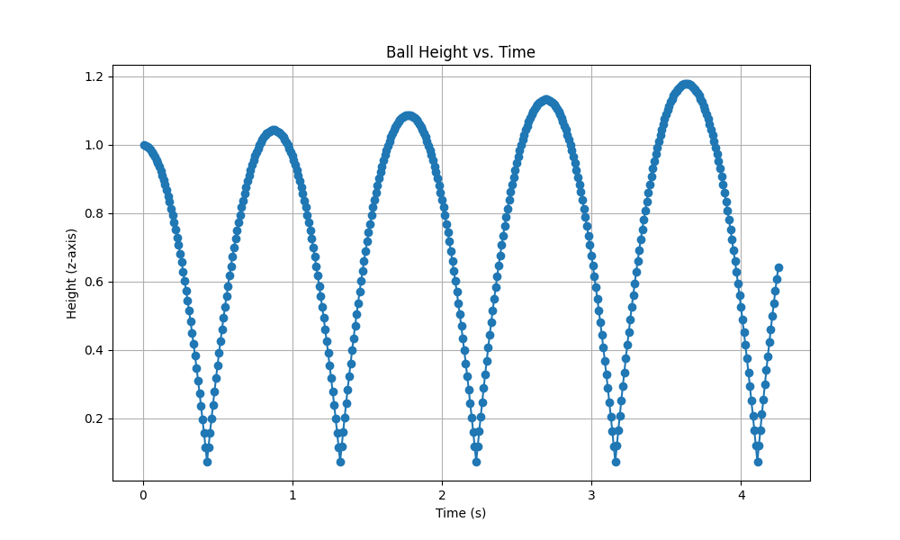  

- 3D Trajectory:  
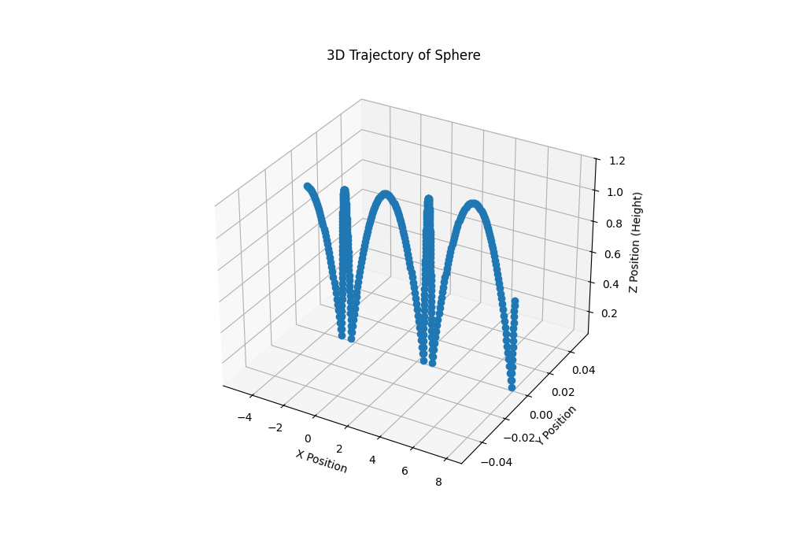  

---

#### ▶️ (c) Single Sphere Bounce with Only Initial Angular Velocity  
- **Description:**  
A spinning sphere without initial linear velocity interacts with the ground, transferring angular momentum into lateral displacement.  

▶️ [Watch Recording](data/recordings/single_sphere/single_sphere_bounce_with_only_angular_velocity.mp4)  

**Plots:**  
- Height vs Time:  
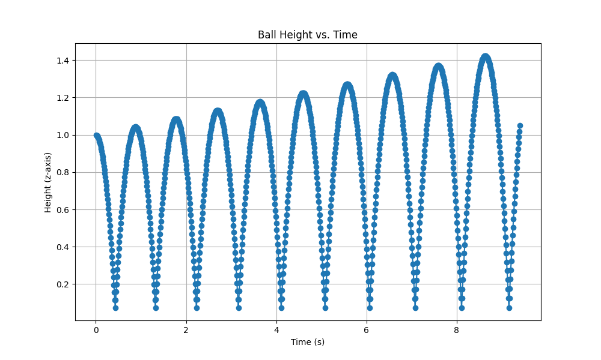  

- 3D Trajectory:  
  

---

#### ▶️ (d) Single Sphere Bounce with Both Initial Linear and Angular Velocities  
- **Description:**  
This scenario shows complex motion arising from combined linear and angular initial velocities, highlighting the impulse-based contact model.  

▶️ [Watch Recording](data/recordings/single_sphere/single_sphere_bounce_with_both_velocities.mp4)  

**Plots:**  
- Height vs Time:  
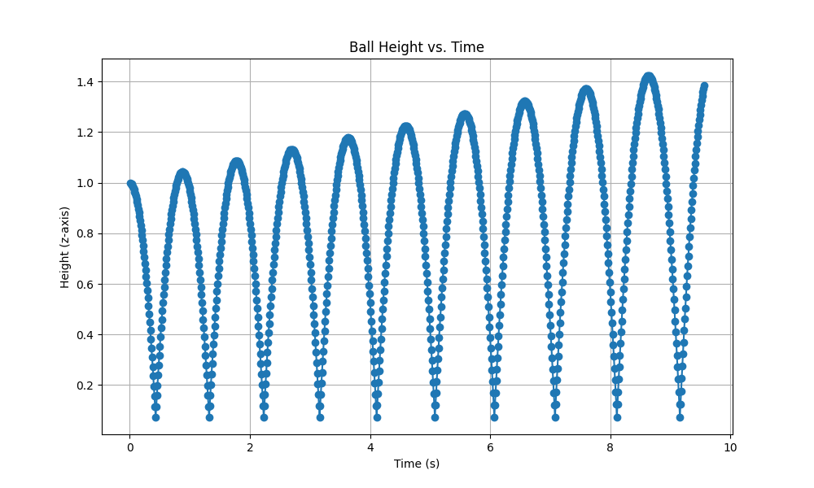  

- 3D Trajectory:  
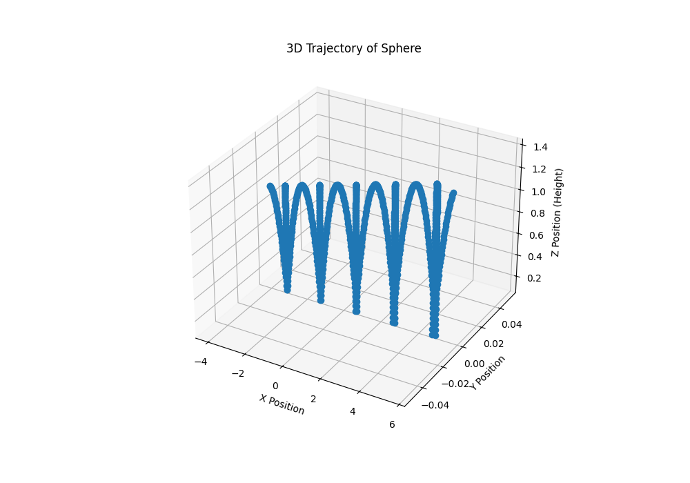  

---

#### ▶️ (e) Single Sphere Rolling and Bouncing on an Incline  
- **Description:**  
A sphere placed on an incline rolls and bounces, demonstrating combined gravitational, frictional, and collision influences.  

▶️ [Watch Recording](data/recordings/single_sphere/sphere_incline_simulation.mp4)  

**Plots:**  
- Height vs Time:  
  

- 3D Trajectory:  
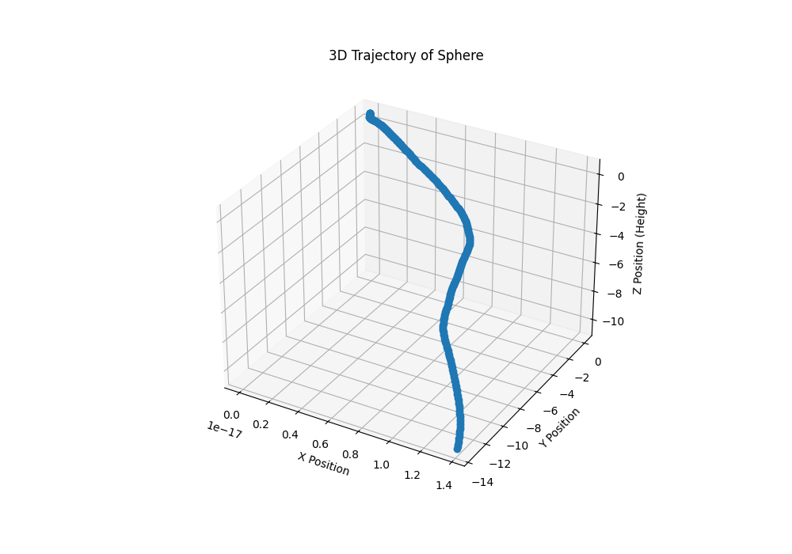  

---

### 2️⃣ Two-Ball Collision  

This scenario simulates two spheres colliding with predefined initial velocities. The collisions are resolved using impulse-based methods preserving momentum and realistic friction responses.  

▶️ [Watch Recording](data/recordings/ball_collision/two_ball_collision.mp4)  

**Plots:**  
- Combined 3D Collision Trajectory:  
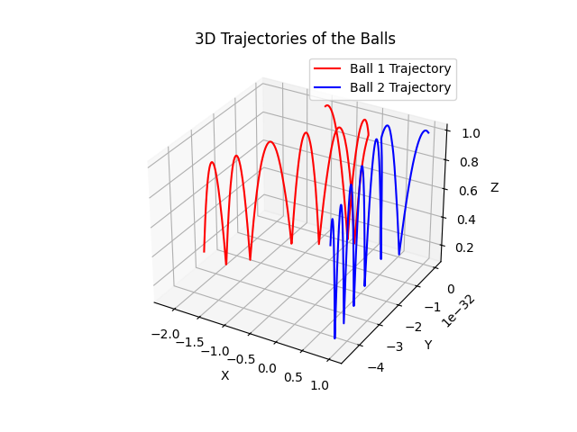  

- **Ball 1:**  
  - Height vs Time:  
    
  - 3D Trajectory:  
    

- **Ball 2:**  
  - Height vs Time:  
  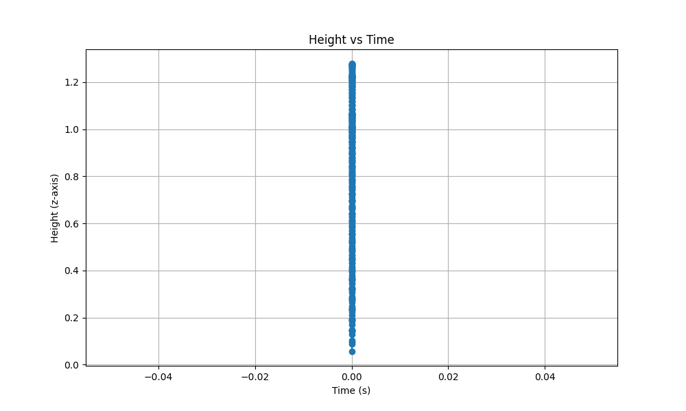  
  - 3D Trajectory:  
  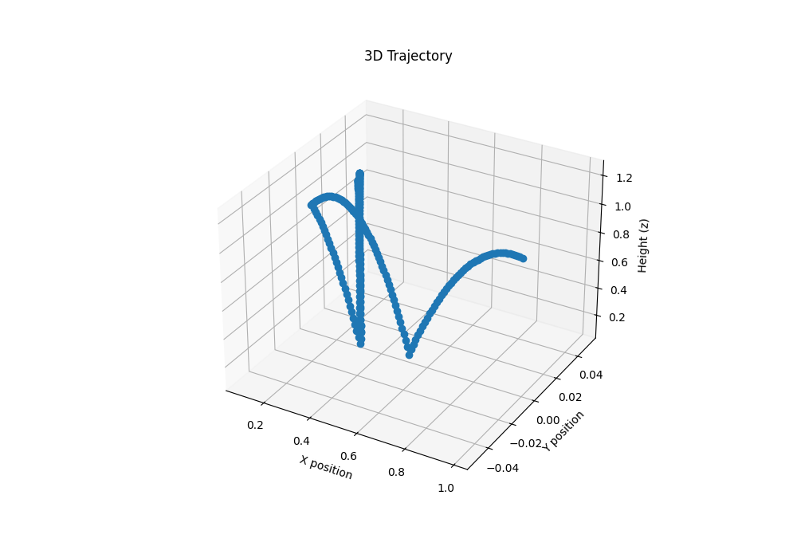  

---

### 3️⃣ Cube Bouncing and Sliding on Incline  

---

#### ▶️ (a) Cube Bouncing on a Flat Surface  
- **Description:**  
A cube dropped onto a flat plane shows distinct rotational and non-uniform bounce patterns due to its shape and multiple contact edges.  

▶️ [Watch Recording](data/recordings/cube/cube_bounce.mp4)  

**Plot:**  
- Height vs Time:  
  

---

#### ▶️ (b) Cube Sliding Down an Inclined Plane  
- **Description:**  
A cube sliding down an inclined surface demonstrates frictional slip, rotations, and partial rolling, replicating realistic rigid body dynamics.  

▶️ [Watch Recording](data/recordings/cube/cube_incline_simulation_good.mp4)  

**Plots:**  
- Height vs Time:  
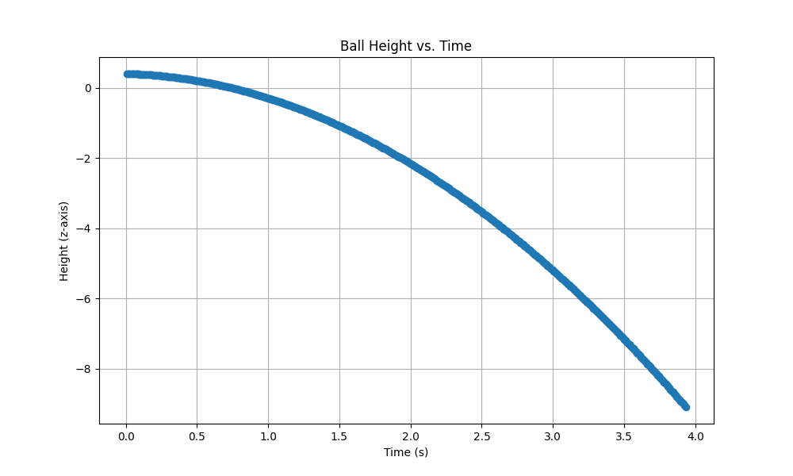  

- 3D Trajectory:  
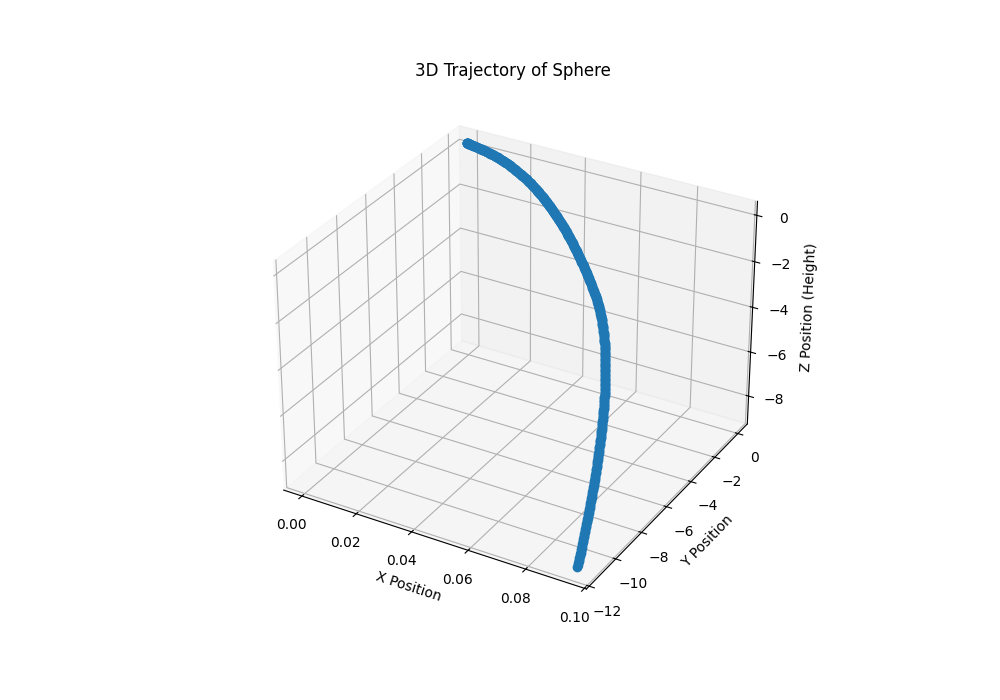  

---

## 🛠️ Implementation Details  

### ✅ Key Algorithms and Their Locations:
| Functionality                                | Location                                                        |
|----------------------------------------------|-----------------------------------------------------------------|
| Impulse-based collision resolution (normal & tangential impulses) | `src/physics/collision.py` — functions like `compute_collision_impulse_friction` |
| Friction modeling                            | `src/physics/collision.py` & `src/physics/physics_utils.py`     |
| Custom simulation stepping schemes           | `src/physics/time_integeration.py` & `src/physics/collision.py` |
| Multi-sphere impulse and friction handling   | `src/simulation/multi_sphere_bounce.py`                         |
| Logging of simulation trajectories & plots   | `src/visualization/data_logger.py`, `multi_sphere_logger.py`, and `logger_base.py` |
| MuJoCo simulation viewer, callbacks, and rendering | `src/viewer/mujoco_viewer.py`                                   |
| Centralized config system (per simulation overrides) | `src/config/` (with overrides, camera settings, recording paths, and global defaults) |
| CLI simulation runner                        | `src/simulate.py`                                               |

---

### 📁 Project Directory Structure  

```
RigidBody-Simulation/
│
├── README.md                     # 📚 Project overview, installation, usage, and documentation
├── .gitignore                    # 🚫 Files & folders to ignore in Git
├── requirements.txt              # 📦 Python dependencies list
├── setup.py                      # ⚙️ Packaging & distribution setup
├── venv/                         # 🐍 Virtual environment (not tracked)
│
├── models/                       # 🏗️ MuJoCo XML models
│   ├── ball_collision.xml        # Two-sphere collision scenario
│   ├── cube.xml                  # Cube on inclined plane setup (with placeholders)
│   ├── multi_sphere.xml          # Multiple spheres bounce scenario
│   └── sphere.xml                # Single sphere bounce scenario
│
├── src/                          # 🛠️ Core source code modules
│   ├── __init__.py
│   ├── simulate.py               # CLI script for running simulations
│   ├── config/                   # ⚙️ Centralized configuration management
│   │   ├── __init__.py
│   │   ├── global_sim_params.py  # Global simulation defaults
│   │   ├── camera_params.py      # Camera settings per simulation
│   │   ├── recording_paths.py    # Output recording paths for each simulation
│   │   └── sim_overrides.py      # Simulation-specific parameter overrides
│   ├── physics/                  # 📐 Custom physics logic & integrators
│   │   ├── __init__.py
│   │   ├── collision.py          # Impulse-based collision & friction handling
│   │   ├── physics_utils.py      # Helper utilities for physics computations
│   │   ├── time_integeration.py  # Custom timestep integrators
│   ├── simulation/               # 🎥 Simulation scripts
│   │   ├── __init__.py
│   │   ├── ball_collision.py     # Two-ball collision simulation
│   │   ├── compare_builtin_simulation.py  # Comparison with MuJoCo’s built-in solver
│   │   ├── cube_incline.py       # Cube sliding on incline simulation (dynamic XML modification)
│   │   ├── multi_sphere_bounce.py # Multi-sphere bouncing simulation
│   │   └── single_sphere_bounce.py # Single sphere bounce simulation
│   ├── viewer/                   # 👁️ GLFW-based visualization & rendering handlers
│   │   ├── __init__.py
│   │   └── mujoco_viewer.py      # Viewer setup, callbacks, main loop
│   └── visualization/            # 📊 Data logging & plotting
│       ├── __init__.py
│       ├── logger_base.py        # Common logger base class
│       ├── data_logger.py        # Logger for single-object simulations
│       └── multi_sphere_logger.py # Logger for multiple spheres with combined plots
│
├── data/                         # 📂 Simulation output data (plots, recordings, reports)
│   ├── plots/                    # 📈 Simulation result plots
│   │   ├── ball_collision/       
│   │   │   ├── 3d_Collisions.png
│   │   │   ├── ball1_height_vs_time.png
│   │   │   ├── ball1_trajectory_3d.png
│   │   │   ├── ball2_height_vs_time.png
│   │   │   └── ball2_trajectory_3d.png
│   │   ├── cube/                 
│   │   │   ├── cube_3d_trajectory.png
│   │   │   └── cube_height_vs_time.png
│   │   ├── multi_sphere/         # (To be generated)
│   │   ├── single_sphere/        
│   │   │   ├── height_vs_time.png
│   │   │   ├── 3d_trajectory.png
│   │   │   ├── sphere_incline_simulation.png
│   │   │   └── sphere_3d_trajectory_incline.png
│   │   └── height_vs_time_builtin.png  # Comparison plot for MuJoCo’s built-in solver
│   ├── recordings/               # 🎥 Simulation recordings
│   │   ├── ball_collision/       
│   │   │   └── two_ball_collision.mp4
│   │   ├── cube/
│   │   │   ├── cube_bounce.mp4
│   │   │   └── cube_incline_simulation_good.mp4
│   │   ├── multi_sphere/
│   │   │   └── multi_sphere_bounce.mp4
│   │   └── single_sphere/
│   │       ├── single_sphere_bounce.mp4
│   │       └── sphere_incline_simulation.mp4
│   └── report.pdf                # 📄 Project report (PDF)
│
└── tests/                        # ✅ Unit tests for simulation components
    ├── __init__.py
    └── test_simulation.py        # Test cases for core physics functions and simulations
```

---

## 🔧 Installation  

### ✅ Using `setup.py` (Recommended)  

> This method will install the project as a Python package locally and make simulation commands easily accessible.

#### 1️⃣ Clone the repository:  
```bash
git clone https://github.com/Aditya-gam/RigidBody-Simulation.git
cd RigidBody-Simulation
```

#### 2️⃣ Set up a virtual environment:  
```bash
python -m venv venv
source venv/bin/activate  # For Windows: venv\Scripts\activate
```

#### 3️⃣ Install the project in editable mode using `setup.py`:  
```bash
pip install -e .
```

#### ✅ Common `setup.py` commands:
| Command                      | Description                                                        |
|------------------------------|--------------------------------------------------------------------|
| `pip install -e .`           | Installs the package in editable mode. All changes are reflected automatically. |
| `python setup.py sdist bdist_wheel` | Builds source and wheel distributions (found in the `dist/` directory).     |
| `pip install dist/<your-wheel-file>.whl` | Install from built distribution manually if needed.                         |
| `python setup.py --help`     | Lists all available `setup.py` commands.                           |

---

### ⚠️ **If the `setup.py` installation doesn't work due to environment issues, follow the manual installation method below.**

---

### ✅ Manual Setup (Alternative)

#### 1️⃣ Install MuJoCo  

Follow the official MuJoCo installation instructions for your OS:  
👉 [MuJoCo Downloads](https://github.com/google-deepmind/mujoco/releases)  

**Basic Setup**:
- Download MuJoCo and extract.
- Set environment variables:  
  - **Linux / Mac**:
  ```bash
  export LD_LIBRARY_PATH=$LD_LIBRARY_PATH:/path/to/mujoco
  export MUJOCO_GL=egl  # Optional for headless
  ```
  - **Windows**:  
  Add MuJoCo to your system PATH and set `MUJOCO_GL` if required.  

> Make sure Python >=3.8 is installed.

#### 2️⃣ Set up manually:
```bash
git clone https://github.com/Aditya-gam/RigidBody-Simulation.git
cd RigidBody-Simulation
python -m venv venv
source venv/bin/activate    # On Windows: venv\Scripts\activate
pip install -r requirements.txt
```
---

## ▶️ How to Run Simulations

You can now run simulations either through the CLI or manually:

### ✅ Run using CLI (after setup.py installation or manual setup):
```bash
python src/simulate.py --sim <simulation_name>
```
**Available simulation names**:
- `single_sphere`
- `multi_sphere`
- `ball_collision`
- `cube_incline`
- `compare_builtin`

**Example**:
```bash
python src/simulate.py --sim single_sphere
```
---

## ✅ Building and Distributing (Optional Developer Steps)

If you want to build the package for distribution or uploading to PyPI:
```bash
python setup.py sdist bdist_wheel
```
You’ll find built distributions in the `dist/` directory.

To install from these built files:
```bash
pip install dist/RigidBody_Simulation_Framework-1.0.0-py3-none-any.whl
```

---

## ✅ Updating or Uninstalling:
- To update your editable install:
```bash
pip install -e . --upgrade
```
- To uninstall:
```bash
pip uninstall RigidBody-Simulation-Framework
```
---

## 📜 License  
This project is licensed under the **Apache License 2.0**.  
For full license terms, refer to the [LICENSE](./LICENSE) file.
